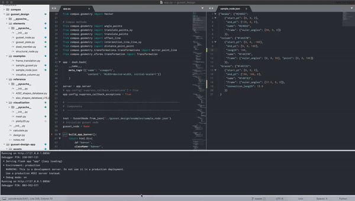

# Gusset Design

This is a rough proof of concept application for gusset plate design exploration implemented in Python using Dash/Plotly for the GUI. The bulk of the application utilizes the separate [gusset_design](https://github.com/m-clare/gusset_design) repository  for some calculation and visualization, and these elements are combined in an interactive dashboard thanks to Dash/Plotly. This was originally conceived and implemented over 2 weeks in September 2019 and presented at the [Recurse Center's](www.recurse.com) Fall [Localhost](https://www.recurse.com/events/localhost-lightning-talks-september-2019).

